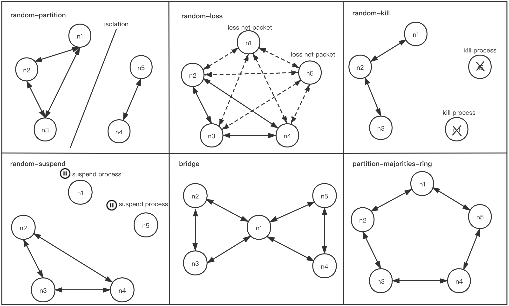

[](https://travis-ci.org/openmessaging/openmessaging-chaos) [](http://search.maven.org/#search%7Cga%7C1%7Copenmessaging-chaos) [](https://www.apache.org/licenses/LICENSE-2.0.html)

# Goals

The framework proposals a unified API for vendors to provide solutions to various aspects of performing the principles of chaos engineering in a Cloud Native environment, its built-in modules will heavily testify reliability, availability and resilience for distriuted system, especially for messaging and eventing. Currently, the community supported the following platforms：

- [Apache RocketMQ](https://rocketmq.apache.org/)
- [Apache Kafka](https://kafka.apache.org/)
- [DLedger](https://github.com/openmessaging/openmessaging-storage-dledger)
- [Redis](https://redis.io/) -- ongoing

## Usage

Take RocketMQ for example:

1. Prepare one control node and some cluster nodes and ensure that the control node can use SSH to log into a bunch of db nodes
2. Edit driver-rocketmq/rocketmq.yaml to set the host name of cluster nodes, client config, broker config.
3. Install openmessaging-chaos in control node:  `mvn clean install`
4. Run the test in the control node: `bin/chaos.sh --driver driver-rocketmq/rocketmq.yaml --install` 
5. After the test, you will get yyyy-MM-dd-HH-mm-ss-driver-chaos-result-file and yyyy-MM-dd-HH-mm-ss-driver-latency-point-graph.png (Gnuplot must be installed).


## Quick Start（Docker）

In one shell, we start the some cluster nodes and the controller using docker compose.

```shell
cd docker
./up.sh --dev
```
In another shell, use `docker exec -it chaos-control bash` to enter the controller, then

```shell
mvn clean install
bin/chaos.sh --driver driver-rocketmq/rocketmq.yaml --install
```

## Option

```
Usage: messaging-chaos [options]
  Options:
    --agent
      Run program as a http agent.
      Default: false
    -c, --concurrency
      The number of clients. eg: 5
      Default: 4
  * -d, --driver
      Driver. eg.: driver-rocketmq/rocketmq.yaml
    -f, --fault
      Fault type to be injected. eg: noop, minor-kill, major-kill, 
      random-kill, fixed-kill, random-partition, fixed-partition, 
      partition-majorities-ring, bridge, random-loss, minor-suspend, 
      major-suspend, random-suspend, fixed-suspend
      Default: noop
    -i, --fault-interval
      Fault injection interval. eg: 30
      Default: 30
    -n, --fault-nodes
      The nodes need to be fault injection. The nodes are separated by 
      semicolons. eg: 'n1;n2;n3'  Note: this parameter must be used with 
      fixed-xxx faults such as fixed-kill, fixed-partition, fixed-suspend.
    -h, --help
      Help message
    --install
      Whether to install program. It will download the installation package on 
      each cluster node. When you first use OpenMessaging-Chaos to test a 
      distributed system, it should be true.
      Default: false
    -t, --limit-time
      Chaos execution time in seconds (excluding check time and recovery 
      time). eg: 60
      Default: 60
    -m, --model
      Test model. Currently queue model and cache model are supported.
      Default: queue
    --order
      Check the partition order of messaging platform. Just for mq model.
      Default: false
    --output-dir
      The directory of history files and the output files
    -p, --port
      The listening port of http agent.
      Default: 8080
    --pull
      Driver use pull consumer, default is push consumer. Just for mq model.
      Default: false
    -r, --rate
      Approximate number of requests per second. eg: 20
      Default: 20
    --recovery
      Calculate failure recovery time.
      Default: false
    --rto
      Calculate failure recovery time in fault.
      Default: false
    -u, --username
      User name for ssh remote login. eg: admin
      Default: root
```

## Fault type

The following fault types are currently supported:
- random-partition (fixed-partition): isolates random(fixed) nodes from the rest of the network.
- random-loss: randomly selected nodes lose network packets.
- random-kill (minor-kill, major-kill, fixed-kill): kill random(minor, major, fixed) processes and restart them.
- random-suspend (minor-suspend, major-suspend, fixed-suspend): pause random(minor, major, fixed) nodes with SIGSTOP/SIGCONT.
- bridge: a grudge which cuts the network in half, but preserves a node in the middle which has uninterrupted bidirectional connectivity to both components (note: number of nodes must be greater than 3).
- partition-majorities-ring: every node can see a majority, but no node sees the same majority as any other. Randomly orders nodes into a ring (note: number of nodes must be equal to 5).




